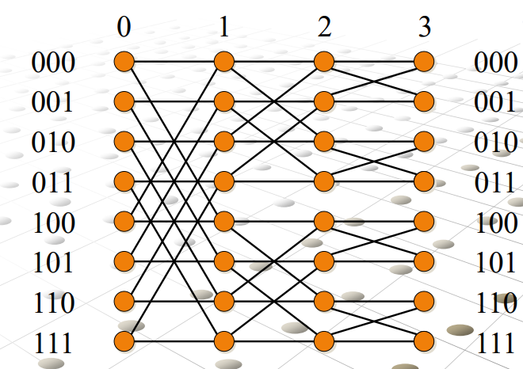

# Butterfly
The Butterfly is an hypercube variant in which the degree of nodes is costant.
## Definition
A Butterfly of dimension ***m*** is defined as follows:
- it's a non directed graph with N = (m + 1) * 2<sup>m</sup> nodes, which can be represented as a matrix with 2<sup>m</sup> rows and m + 1 columns
- every node is identified by a couple **(w, i)**, where w is a m bit string that defines the row of the node, and i is an integer between 0 and m that defines the column or level in which the node belongs.
- given two nodes (w, i) and (w', i') there can be two link between them. A **direct link** if w = w' and i' = (i + 1), or a **crossed link** if i' = (i + 1) and w and w' differ exactly in the ***i***-bit.

Note: the crossed links operate like the hypercube links. Infact, the i-row of a buttefly simulates the i-node of the hypercube. So if we merge all the nodes of each row in one node, we obtain a hypercube of dimension m.


## Properties
- Number of nodes: **(m + 1) * 2<sup>m</sup>**
- Number of edges: **m * 2<sup>m + 1</sup>** (2 edges for each node except the nodes of the last level)
- Bisection: **O(N / log N)** (Removes all crossed links of level 0)
- Diameter: **O(log N)**


## Routing
The idea of the routing algorithm is based on the property that given a node of level 0 you can reach any other node with a single path of length O(log N). So, the routing algorithm is divided in three phases and each phase has a complexity of O(log N).

Here the three phases to go from a node (w, i) to a node (w', i'):
1. From the source go to "left" until you reach a node of level 0 (w, 0). This requires almost log N steps because we have log N + 1 levels.
2. Here we fix the bits of w to reach the row w':
   ```
    for(i = 0; i < m; i++)
        if(i-bit of w is different from i-bit of w')
            use the crossed link to fix the i-bit
        else
            use the direct link 
   ```
   This operation require exactly log N steps.
3. We have reached the last node of w' row, so we go to "left" until we find the node (w', i'). This requires almost log N steps.
