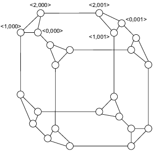

# Cube Connected Cycles
The CCC is an hypercube variant in which the degree of nodes is costant.
## Definition
A CCC of dimension ***m*** is defined as follows:
- it's a hypercube of dimension m in which every hypercube node is replaced with a cycle of m nodes. So N = m * 2<sup>m</sup>
- every node is identified by a couple **(w, i)**, where w is a m bit string that defines the label of the hypercube node that has been replaced, and i is an integer between 0 and m-1 which defines the position of the node in the cycle.
- given a node **(w, i)**, it has three link. One at the successor and precedessor in the cycle (**links of the cycle**), and one to the node **(w', i)** where w and w' differ exactly on the ***i***-bit, this link is called **hypercube link** because it is the link *i* of the node *w* of the hypercube of dimension m.





## Properties
- Number of nodes: **m * 2<sup>m</sup>**
- Number of edges: **3 m * 2<sup>m-1</sup>** (every node has three link)
- Bisection: **O(N / log N)** (Removes all the i-dimension link of the hypercube)
- Diameter: **O(log N)**

## Routing
The idea of the routing algorithm is very simple. In fact, each cycle of m nodes can easily simulate each of the node of the hypercube of dimension m.

So, if (w, i) is the source, and (w', i') is the target, the algorithm is the following:

```
for(k = 0, j = i; k < m; k++, j = (j+1) mod m) {
    if(j-bit of w is different from the j-bit of w')
        use the hypercube link to fix the j-bit
    use the link to the successor to advance in the cycle
}

We have now reached a node of the cycle with label w', therefore we simply move in the cycle until we find the node (w', i')
```
So the for executes at most 2m steps and the last research can be done in other m/2 steps. So the routing algorithm needs O(m) = O(log N) steps.