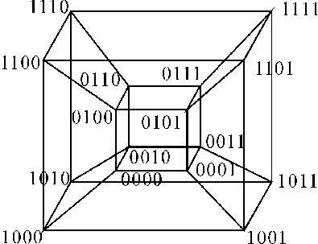

# Hypercube
The hypercube is one of the most powerful parallel architecture.
## Definition
An hypercube of dimension ***m*** is defined as follows:
- it's a non directed graph with N = 2m nodes and every node has m neighbors
- every node has an unique label which is a m bit string (there are all the 2m possible binary strings of length m) and from two nodes ***u*** and ***v*** there is a link if their labels differ in a single bit. (For example there is a link between '100' and '101', but not between '100' and '111'). In addition links which connect two nodes who differ on the ***i***-bit are called **links of dimension *i***.

     

## Properties
- Number of nodes: 2m
- Number of edges: m * 2m-1
- Bisection: 2m-1 (Removes all links of a dimension)
- Diameter: m = log (2m)